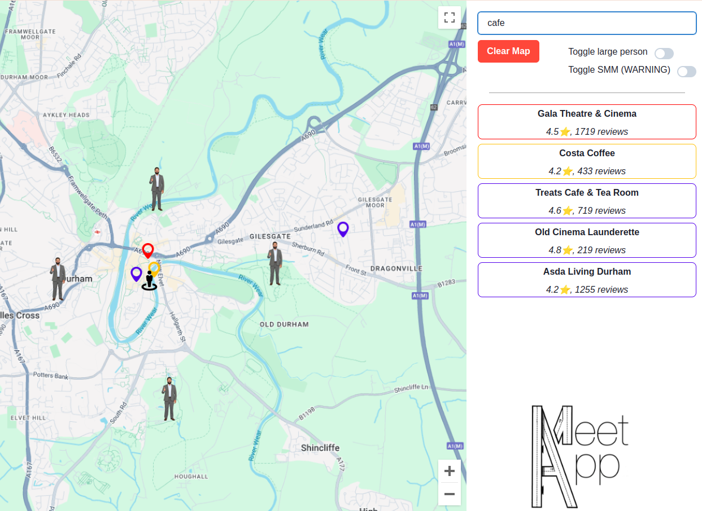

# MeetApp

An app to meet *app* with your friends!

## Usage
Repo contains both the backend (`/backend`) nodejs server and the frontend ReactJs app(`/src`). 
1) Clone the git repo
2) Set up Google API
Setting up Google API.
    1) Generate a [Google API](https://console.cloud.google.com/) key and enable Places API, Distance Matrix API and Maps Javascript API  
    2) Create a `.env` file in the root folder and write `REACT_APP_GOOGLE_API_KEY=<your api key>`
3) Install front end dependencies `npm install` from root folder
4) Install backend dependencies: `cd /backend` then `npm install`
5) Start backend: `node app.js` from `/backend`. It will run on `localhost:3080`
6) Start front end: `npm start` from root. It will launch on `localhost:3000`

